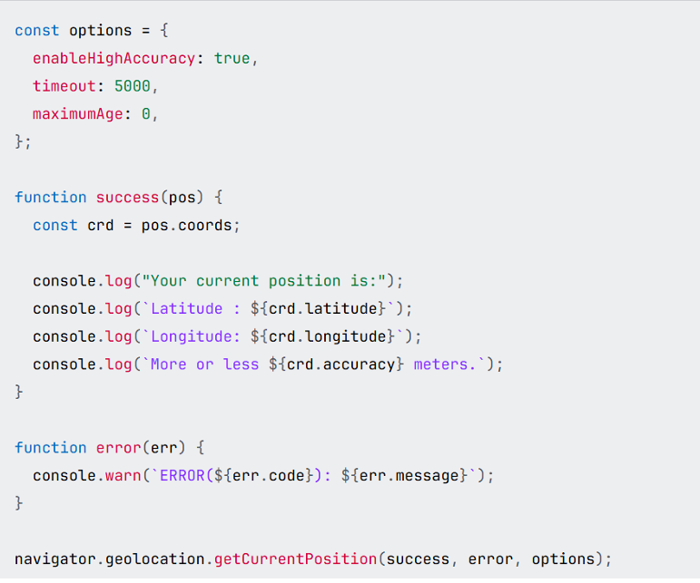

## getCurrentPosition() is a method which can be found device’s current 
location works with HTTPS websites 
If it is not working at all may be it is blocked by geolocation 
### Permissions-Policy. 
### getCurrentPosition(success) 
### getCurrentPosition(success, error) 
### getCurrentPosition(success, error, options) 
### success 
A callback function that takes a GeolocationPosition object as its sole input parameter. 
error Optional 
An optional callback function that takes a GeolocationPositionError object as its sole 
input parameter. 
options Optional 
### maximumAge 
This is also a good method we can predict device’s milestones, if it is maximumAge 0 ,it asks new location gps all 
the time.If it is more than 0 it will ask only that period for example 5(5000 milesstones) and after that period it will 
give you old gps.if its value is infinity it gives you only older gps locations. 
### Timeout – it is like infinity it gives old location 
### EnableHighAccuracy- it is boolean if it is true it can give you possible locations 

### watchPosition() method

It is available since 2015 July.That is a handler function which finds eachtime user changes location . We can also error handle with it. We can handle it by ID.It has options,error,success just like getCurrentPosition() function.

let id;
let target;
let options;

function success(pos) {
  const crd = pos.coords;

  if (target.latitude === crd.latitude && target.longitude === crd.longitude) {
    console.log("Congratulations, you reached the target");
    navigator.geolocation.clearWatch(id);
  }
}

function error(err) {
  console.error(`ERROR(${err.code}): ${err.message}`);
}

target = {
  latitude: 0,
  longitude: 0,
};

options = {
  enableHighAccuracy: false,
  timeout: 5000,
  maximumAge: 0,
};

id = navigator.geolocation.watchPosition(success, error, options);

### Interfaces

### Geolocation

It is main class of this API. 

### GeolocationPosition

Represents location of a user.A succesfull call  of method in Geolocation.inside a success callback, and contains a timestamp plus a GeolocationCoordinates object instance.

### GeolocationPositionError

it is also error notifier

The Geolocation API allows users to programmatically access location information in secure contexts.
Access may further be controlled by the Permissions Policy directive geolocation. The default allowlist for geolocation is self, which allows access to location information in same-origin nested frames only. Third party usage is enabled by setting a Permissions-Policy response header to grant permission to a particular third party origin:

### http

Permissions-Policy: geolocation=(self b.example.com)

The allow="geolocation" attribute must then be added to the iframe element with sources from that origin:

### html

<iframe src="https://b.example.com" allow="geolocation"></iframe>

Geolocation data may reveal information that the device owner does not want to share. Therefore, users must grant explicit permission via a prompt when either Geolocation.getCurrentPosition() or Geolocation.watchPosition() is called (unless the permission state is already granted or denied). The lifetime of a granted permission depends on the user agent, and may be time based, session based, or even permanent. The Permissions API geolocation permission can be used to test whether access to use location information is granted, denied or prompt (requires user acknowledgement of a prompt).

A GeolocationPositionError is returned by an unsuccessful call to one of the methods contained inside Geolocation, inside an error callback, and contains an error code and message.

### variables 

### let 

The let declaration declares re-assignable, block-scoped local variables, optionally initializing each to a value.Let is confirmed and used since 2016

let x = 1;

if (x === 1) {
  let x = 2;

  console.log(x);
  // Expected output: 2
}

console.log(x);
// Expected output: 1

let name1;
let name1 = value1;
let name1 = value1, name2 = value2;
let name1, name2 = value2;
let name1 = value1, name2, /* …, */ nameN = valueN;

### var
The var statement declares function-scoped or globally-scoped variables, optionally initializing each to a value.Var is used since 2015 for all browsers.

var x = 1;

if (x === 1) {
  var x = 2;

  console.log(x);
  // Expected output: 2
}

console.log(x);
// Expected output: 2

function foo() {
  var x = 1;
  function bar() {
    var y = 2;
    console.log(x); // 1 (function `bar` closes over `x`)
    console.log(y); // 2 (`y` is in scope)
  }
  bar();
  console.log(x); // 1 (`x` is in scope)
  console.log(y); // ReferenceError, `y` is scoped to `bar`
}

foo();

### for (var a of [1, 2, 3]);
console.log(a); // 3

Above, for cycle is not working so it takes last value of array.

### for (let a of [1, 2, 3]);
console.log(a);

for this value it gives : Reference error

Because var is function scope but let is block scope.

let a lives inside for{} but var lives in whole function.

### delete operator

"use strict";
var x = 1;
Object.hasOwn(globalThis, "x"); // true
delete globalThis.x; // TypeError in strict mode. Fails silently otherwise.
delete x; // SyntaxError in strict mode. Fails silently otherwise.

